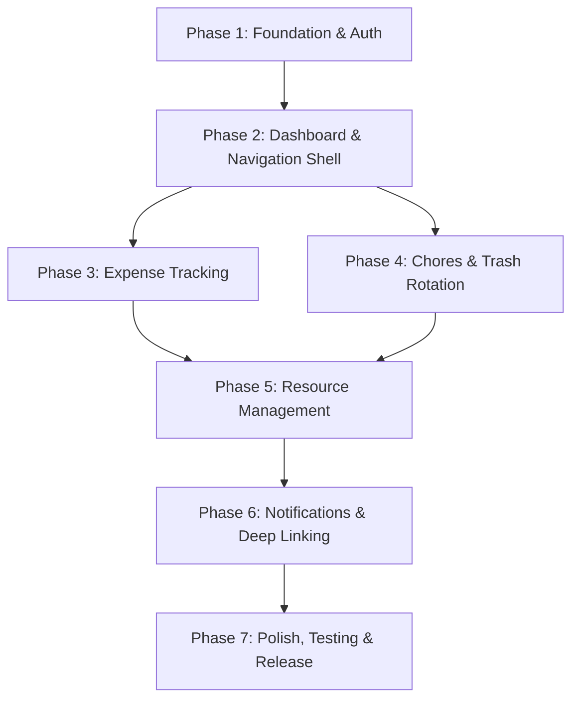

# 🏠 Shared Space – Master Implementation Plan

> **Document Version:** 1.0  
> **Last Updated:** April 14, 2026  
> **Governance:** All phases MUST comply with [`.specify/memory/constitution.md`](.specify/memory/constitution.md)  
> **PRD Reference:** [`PRD.md`](PRD.md)  
> **Firebase Project:** `chaty-86c83` — Database: `ai-studio-a21ea095-7636-4180-8c27-e7cc691f29fe`

---

## How This Plan Works

Each **Phase** below is an independent Spec Kit cycle. To execute a phase:

```
1.  /speckit-specify  <paste the phase description below>
2.  /speckit-plan      (generates plan.md in the feature dir)
3.  /speckit-tasks     (generates tasks.md in the feature dir)
4.  /speckit-implement (executes all tasks)
```

Phases are **strictly sequential** — each depends on deliverables from the previous one. Do NOT skip or reorder phases.

### Constitution Checkpoint (Every Phase)

Before marking a phase complete, verify against all 7 principles:

| # | Principle | Quick Check |
|---|-----------|-------------|
| I | Flutter-First | Pure Dart, Riverpod, go_router, freezed — no native modules |
| II | Firebase-Native | `chaty-86c83`, flat-collection schema from `firebase-blueprint.json` |
| III | Design Excellence | Gradients, shimmer, animations, Outfit/Tajawal fonts, Liquid Glass nav |
| IV | Real-Time & Offline-First | StreamProviders, Firestore offline cache, Hive pending writes |
| V | Security-by-Default | All reads/writes pass `firestore.rules`, no client-bypass |
| VI | RTL & Localization | `easy_localization` EN/AR, RTL layout mirroring active |
| VII | GitHub-Driven | Feature branch, PR merged, README updated |

---

## Phase Dependency Graph



---

## Phase 1: Foundation & Auth

> **Spec Kit Feature Name:** `foundation-auth`  
> **Estimated Duration:** 1.5 weeks  
> **Branch:** `feature/001-foundation-auth`  
> **Prerequisites:** None (greenfield)

### Objective

Create the Flutter project, configure Firebase, implement the design system, build authentication (Google + Email/Password), and wire up apartment creation/joining. At the end of this phase, a user can sign in, create or join an apartment, and land on a placeholder home screen.

### Scope

#### 1.1 Flutter Project Scaffolding
- Initialize Flutter project with `flutter create` (package name: `com.sharedspace.app`)
- Configure `pubspec.yaml` with ALL dependencies from PRD §5:
  - `flutter_riverpod`, `riverpod_annotation`, `riverpod_generator`
  - `go_router`
  - `freezed`, `freezed_annotation`, `json_serializable`, `json_annotation`
  - `firebase_core`, `firebase_auth`, `cloud_firestore`, `firebase_messaging`
  - `google_sign_in`
  - `hive`, `hive_flutter`
  - `easy_localization`
  - `google_fonts`
  - `lucide_icons_flutter`
  - `connectivity_plus`, `share_plus`, `cached_network_image`
  - Dev dependencies: `build_runner`, `riverpod_lint`, `flutter_lints`
- Set `minSdkVersion: 24`, `targetSdkVersion: 35`, `compileSdkVersion: 35`
- Create folder structure:
  ```
  lib/
  ├── app.dart                     # MaterialApp.router root
  ├── main.dart                    # Entry point, Firebase init, Hive init
  ├── core/
  │   ├── theme/                   # Design system tokens
  │   │   ├── app_colors.dart
  │   │   ├── app_text_styles.dart
  │   │   ├── app_gradients.dart
  │   │   ├── app_shadows.dart
  │   │   ├── app_spacing.dart
  │   │   ├── app_border_radius.dart
  │   │   └── app_theme.dart       # ThemeData assembly
  │   ├── router/
  │   │   └── app_router.dart      # go_router config + auth guard
  │   ├── providers/
  │   │   ├── firebase_providers.dart
  │   │   └── connectivity_provider.dart
  │   ├── constants/
  │   │   └── firestore_paths.dart  # Collection name constants
  │   ├── utils/
  │   │   └── validators.dart
  │   └── widgets/                 # Shared reusable widgets
  │       ├── app_button.dart
  │       ├── app_card.dart
  │       ├── app_text_field.dart
  │       ├── shimmer_loading.dart
  │       └── offline_banner.dart
  ├── features/
  │   ├── auth/
  │   │   ├── data/
  │   │   │   └── auth_repository.dart
  │   │   ├── domain/
  │   │   │   └── auth_state.dart
  │   │   ├── presentation/
  │   │   │   ├── login_screen.dart
  │   │   │   └── widgets/
  │   │   └── providers/
  │   │       └── auth_provider.dart
  │   └── apartment/
  │       ├── data/
  │       │   └── apartment_repository.dart
  │       ├── domain/
  │       │   └── models/           # freezed: Apartment, ApartmentMember, User
  │       ├── presentation/
  │       │   ├── create_apartment_screen.dart
  │       │   ├── join_apartment_screen.dart
  │       │   └── apartment_selection_screen.dart
  │       └── providers/
  │           └── apartment_provider.dart
  └── l10n/
      ├── en.json
      └── ar.json
  ```

#### 1.2 Design System Implementation (PRD §6)
- Implement every token class exactly as defined in PRD §6.1–6.6:
  - `AppColors` — brand, semantic, background, typography colours
  - `AppTextStyles` — Outfit (Latin) / Tajawal (Arabic), all 6 scale levels
  - `AppGradients` — primaryCard, secondaryCard
  - `AppShadows` — card, primaryButton
  - `AppSpacing` — 8-point grid (xs through xxl)
  - `AppBorderRadius` — small through xxLarge
- Build `AppTheme.lightTheme()` assembling all tokens into `ThemeData`
- Build reusable widgets: `AppButton` (primary/secondary/text), `AppCard`, `AppTextField`, `ShimmerLoading`

#### 1.3 Firebase Configuration
- Add `google-services.json` for Android
- Initialize Firebase in `main.dart`
- Enable Firestore offline persistence (`CACHE_SIZE_UNLIMITED`)
- Initialize Hive with Flutter
- Set up Riverpod providers for `FirebaseAuth.instance` and `FirebaseFirestore.instance`

#### 1.4 Authentication Flow (PRD §4.1.1)
- **Google Sign-In**: Single-tap auth using device Google account
- **Email/Password Sign-In**: Registration + login forms, password reset
- **Session persistence**: User stays logged in until manual logout
- **Auth state stream**: Riverpod `StreamProvider` watching `authStateChanges()`
- **User profile creation**: On first sign-in, create `/users/{uid}` document in Firestore
- **Login screen**: Beautiful UI matching PRD §6 design system — gradient background, branded logo, Google sign-in button, email/password form

#### 1.5 Apartment Creation & Joining (PRD §4.1.2–4.1.3)
- **Create apartment**: Name input → generate 6-char invite code → create `/apartments/{id}` + `/apartmentMembers/{id}` docs → creator becomes admin
- **Join apartment**: Enter code → validate → show apartment preview (name, member count) → create membership doc → navigate to home
- **Multi-space support** (PRD §4.1.4): Store current apartment ID in Hive, switcher dropdown in app bar
- **Apartment selection screen**: Shown when user has no apartment or after logout from apartment

#### 1.6 Routing & Auth Guards
- `go_router` with declarative routes from PRD §5.5
- Auth redirect: unauthenticated → `/auth`, authenticated with no apartment → `/onboarding`, authenticated with apartment → `/home`
- Route definitions for auth, apartment CRUD, and home shell (dashboard placeholder)

#### 1.7 Localization Setup
- `easy_localization` initialized in `main.dart`
- Translation files: `assets/translations/en.json`, `assets/translations/ar.json`
- All user-facing strings go through `.tr()` from day one
- RTL layout mirroring verified on Arabic locale

### Deliverables
- [ ] Flutter project builds and runs on Android API 24+ emulator
- [ ] Design system tokens match PRD §6 pixel-perfectly
- [ ] Google Sign-In and Email/Password auth work e2e with Firebase
- [ ] User can create an apartment (persists to Firestore)
- [ ] User can join an apartment via invite code
- [ ] Auth guard redirects correctly based on auth + apartment state
- [ ] EN/AR localization toggleable, RTL layout mirrors correctly
- [ ] Offline banner appears when connectivity is lost
- [ ] GitHub: PR merged, README updated with Phase 1 status

### Key Database Interactions
| Collection | Operations |
|---|---|
| `/users/{uid}` | Create (on first sign-in), Read (profile) |
| `/apartments/{id}` | Create (new apartment), Read (by invite code) |
| `/apartmentMembers/{id}` | Create (join/create), Read (membership check) |

---

## Phase 2: Dashboard & Navigation Shell

> **Spec Kit Feature Name:** `dashboard-navigation`  
> **Estimated Duration:** 1.5 weeks  
> **Branch:** `feature/002-dashboard-navigation`  
> **Prerequisites:** Phase 1 complete (auth, apartment, design system)

### Objective

Build the main navigation shell with the Liquid Glass bottom nav bar, implement the Dashboard as the command center with live data widgets, and establish the real-time data streaming patterns that all subsequent phases will reuse.

### Scope

#### 2.1 Bottom Navigation Shell (PRD §9.1, §6.9.8)
- **Liquid Glass bottom nav bar**: Custom frosted-glass effect with blur, 5 tabs (Dashboard, Expenses, Chores, Shower, More)
- Nested navigation using `StatefulShellRoute` in go_router
- Tab-specific route state preservation
- Badge indicators on tabs (unread counts)
- Animated tab switching with cross-fade + scale

#### 2.2 Dashboard Screen (PRD §4.2)
- **Header section** (§4.2.1): Time-based greeting ("Good Morning, [Name] 🌅"), apartment switcher dropdown, current date
- **Quick Stats Widget** (§4.2.2): 4 gradient stat cards in a 2×2 grid — Pending Bills, Your Balance, Active Chores, Grocery Items — each with live Firestore stream
- **Shower Status Widget** (§4.2.3): Real-time shower status card — Free (green pulse + "Book Now"), Occupied (countdown timer + progress), Queued (list preview)
- **Next Up Section** (§4.2.4): Most urgent action card — Trash Turn, Overdue Chore, Upcoming Shower, or Unsettled Debt with priority ordering
- **Recent Activity Feed** (§4.2.5): Last 5-7 events in timeline-style cards with icons and timestamps

#### 2.3 "More" Drawer/Menu (PRD §9.2)
- Expandable menu from the 5th tab
- Sections: Household Management (Trash Turn, Groceries, Calendar), Apartment Settings (Members, Balances, Invite), Personal (Profile, Notifications, Language), Support (Help, About, Sign Out)
- Each item navigates to its respective screen (placeholder screens for unbuilt features)

#### 2.4 Real-Time Data Layer
- Create `StreamProvider` patterns for all dashboard data:
  - `expenseStreamProvider(apartmentId)` — pending expenses count + balance
  - `choreStreamProvider(apartmentId)` — active chore count
  - `showerStreamProvider(apartmentId)` — current shower status
  - `groceryCountProvider(apartmentId)` — grocery item count
  - `activityFeedProvider(apartmentId)` — recent changes across collections
- Establish the repository pattern: `Repository` → `Provider` → `Widget` pipeline
- Error handling: graceful degradation with retry UI

#### 2.5 Offline Banner & Connectivity
- `ConnectivityProvider` stream watching network state
- Animated top banner: "Offline — Changes will sync when connected"
- Auto-dismiss when connectivity restored with "Syncing…" snackbar

### Deliverables
- [ ] Liquid Glass bottom nav bar with 5 tabs, animated transitions
- [ ] Dashboard shows live data from ALL stat categories (even if 0)
- [ ] Shower status card reflects real-time Firestore state
- [ ] "Next Up" card prioritizes correctly (overdue → current → upcoming → debts)
- [ ] Activity feed shows recent cross-collection events
- [ ] "More" menu navigates to placeholder screens
- [ ] All widgets use shimmer loading states, not spinners
- [ ] Apartment switcher works if user belongs to multiple apartments
- [ ] GitHub: PR merged, README updated

### Key Database Interactions
| Collection | Operations |
|---|---|
| `/expenses` | Stream (where apartmentId == current, count pending) |
| `/expenseSplits` | Stream (where userId == current, sum balances) |
| `/chores` | Stream (where apartmentId == current, count active) |
| `/groceries` | Stream (where apartmentId == current, count needed) |
| `/showerSlots` | Stream (where apartmentId == current, active/scheduled) |
| `/trashHistory` | Read (last entry for "Next Up") |
| `/apartments` | Read (current apartment metadata) |

---

## Phase 3: Expense Tracking & Bill Splitting

> **Spec Kit Feature Name:** `expense-tracking`  
> **Estimated Duration:** 2 weeks  
> **Branch:** `feature/003-expense-tracking`  
> **Prerequisites:** Phase 2 complete (navigation shell, stream providers)

### Objective

Build the complete expense management system: list view with filters, multi-step add expense flow (bottom sheet), debt calculation/balances screen, and settlement workflow. This is the most data-intensive feature.

### Scope

#### 3.1 Expense List View (PRD §4.3.1)
- Chronological feed of expenses (newest first)
- Filter chips: All, Pending, Settled, My Expenses
- Search by description or person
- Sort options: Date, Amount, Status
- Expense card design per PRD: description, amount, paid-by, split count, date, your share, status badge
- Tap to expand with full split details
- Infinite scroll / pagination
- Shimmer loading for initial load

#### 3.2 Add Expense Flow (PRD §4.3.2)
- Multi-step bottom sheet (4 steps per PRD):
  - Step 1: Basic Info — description, amount with currency, category dropdown, date picker
  - Step 2: Who Paid — single-select member list with avatars
  - Step 3: Split Method — Equal (auto-divide) / Custom (manual per-person), member checkboxes, real-time validation
  - Step 4: Review & Submit — summary card, per-person breakdown, submit button
- Client-side validation: amount > 0, description not empty, splits sum to total
- Optimistic write → Firestore create → rollback on failure

#### 3.3 Debt Calculation & Balances (PRD §4.3.3)
- **Balance Algorithm**: Net balance = total paid − total owed per person, simplified to min transactions
- **Balances Screen**: Net balance hero card (green/red/gray), individual debt list with "Settle Up" button per person
- **Settlement Flow**: Tap "Settle Up" → confirmation modal → optional payment note → mark affected expense splits as settled → notification

#### 3.4 Expense History (PRD §4.3.4)
- Infinite scroll with monthly grouping and subtotals
- Delete expense with 10-second undo snackbar
- Edit expense (re-opens the add flow pre-populated)

### Deliverables
- [ ] Expense list with filters, search, sort — all functional with real Firestore data
- [ ] 4-step add expense bottom sheet with validation
- [ ] Equal and custom split both work correctly
- [ ] Balances screen shows correct net calculations
- [ ] Settlement flow updates all affected splits atomically (Firestore batch write)
- [ ] Delete with undo grace period
- [ ] Animations: card stagger in, bottom sheet slide-up, completion celebration
- [ ] GitHub: PR merged, README updated

### Key Database Interactions
| Collection | Operations |
|---|---|
| `/expenses` | Create, Read (stream + paginated), Update (settle), Delete |
| `/expenseSplits` | Create (during add), Read (stream), Update (settle) |
| `/apartmentMembers` | Read (member list for split selection) |

---

## Phase 4: Chores & Trash Rotation

> **Spec Kit Feature Name:** `chores-trash-rotation`  
> **Estimated Duration:** 2 weeks  
> **Branch:** `feature/004-chores-trash-rotation`  
> **Prerequisites:** Phase 2 complete (navigation shell)

### Objective

Build the chore management system (list, add/edit, completion with animations) and the trash rotation system (current turn, mark-done, override, away status, audit log). These two features share similar UX patterns (assignment, completion, history).

### Scope

#### 4.1 Chore List View (PRD §4.4.1)
- Toggle: My Chores / All Chores
- Status tabs: Pending, Completed, Overdue
- Sort by: Due date, Created date, Assignee
- Chore card per PRD: title, assignee avatar, due date indicator (green/orange/red), completion checkbox, swipe actions (edit/delete — admin only)
- Visual indicators: overdue (red tint + ⚠), due today (orange border), completed (strikethrough + faded), unassigned (gray dotted)

#### 4.2 Add/Edit Chore (PRD §4.4.2)
- Bottom sheet: title, description, assign-to picker (member list + "Assign to me" + "Unassigned"), due date with quick options (Today, Tomorrow, This Weekend, Next Week)
- Validation: title not empty, due date not in past

#### 4.3 Chore Completion (PRD §4.4.3)
- Tap checkbox → completion animation (checkmark bounce + confetti)
- Move to "Completed" tab with timestamp
- 10-second undo via snackbar
- Real-time update for all apartment members

#### 4.4 Trash Turn Main Screen (PRD §4.5.1)
- **Current Turn Hero Card**: "Your Turn! 🗑️" (pulsing) or "[Name]'s Turn" with avatar
- **"Mark as Done" button** (only visible to current person)
- **Rotation Order**: Numbered circular avatar list, current highlighted, away members grayed
- **Last taken**: "[Name] took it out [X time ago]"

#### 4.5 Trash Rotation Logic (PRD §4.5.2–4.5.4)
- **Mark as Done**: Confirmation → log to `/trashHistory` → increment `currentTrashTurnerIndex` (skip away members) → success animation → notify next person
- **"I Threw It" Override** (PRD §4.5.3): Logs action with `isOutOfTurn: true`, does NOT shift rotation
- **Away Status** (PRD §4.5.4): Self-service toggle via `apartmentMembers.isAway`, auto-skip logic, admin force toggle
- **Rotation management** (admin): Drag-to-reorder `apartment.trashRotationOrder` array

#### 4.6 Trash Audit Log (PRD §4.5.5)
- Timeline-style history: action type (Done/Override/Skip), who, when (relative time)
- Filter: All, Done, Overrides, Skips
- Infinite scroll paginated

### Deliverables
- [ ] Chore CRUD fully functional with Firestore
- [ ] Chore completion animation (checkmark + confetti) matches PRD
- [ ] Trash rotation correct: skips "away" members, override doesn't shift index
- [ ] Rotation reorder (admin) persists to Firestore
- [ ] Audit log renders correctly with timeline UI
- [ ] All visual indicators per PRD (overdue red, due-today orange, etc.)
- [ ] Swipe actions on chore cards with flutter_slidable
- [ ] GitHub: PR merged, README updated

### Key Database Interactions
| Collection | Operations |
|---|---|
| `/chores` | Create, Read (stream + filtered), Update (complete/edit), Delete |
| `/apartments` | Read/Update (trashRotationOrder, currentTrashTurnerIndex) |
| `/apartmentMembers` | Read (members for assignment), Update (isAway toggle) |
| `/trashHistory` | Create (mark done/override/skip), Read (stream + paginated) |

---

## Phase 5: Resource Management (Shower, Groceries, Calendar)

> **Spec Kit Feature Name:** `resource-management`  
> **Estimated Duration:** 2 weeks  
> **Branch:** `feature/005-resource-management`  
> **Prerequisites:** Phase 3 and Phase 4 complete

### Objective

Build the three remaining data features: Shower Queue (real-time booking with countdown timers and hot water buffer), Shared Groceries (collaborative shopping list), and Shared Calendar (event scheduling with category icons).

### Scope

#### 5.1 Shower Queue (PRD §4.6)
- **Overview Screen** (§4.6.1): Live status hero card — Free (green pulse + "Book Now"), Occupied (name + countdown timer + circular progress), Cooling Down (orange flame + buffer countdown)
- **Book Shower Flow** (§4.6.2): Bottom sheet — duration picker (10/15/30/Custom), start time (Now or schedule later), preview showing end + cooldown time, validation (no overlap, respect buffer)
- **Hot Water Buffer** (§4.6.3): Admin configurable (10-30 mins), enforced during booking validation
- **Active Shower Management** (§4.6.4): "I'm Done" button, extend time (+5/+10 min), real-time countdown, auto-transition to cooldown at timer end
- **Queue Management** (§4.6.5): Cancel own booking, FIFO ordering, max 7-day advance booking

#### 5.2 Shared Groceries (PRD §4.7)
- **Grocery List** (§4.7.1): Active Items tab (checkable list), Purchased tab (history), search, sort by recent/alphabetical
- **Add Item** (§4.7.2): Quick-add bottom sheet — name, quantity + unit dropdown, notes
- **Mark Purchased** (§4.7.3): Single-tap checkbox → slide+fade animation → move to Purchased → log buyer + timestamp, 10-second undo
- **Item Management** (§4.7.4): Long-press to edit, swipe to delete, re-add from purchased, admin "Clear All Purchased"

#### 5.3 Shared Calendar (PRD §4.8)
- **Calendar Views** (§4.8.1): Monthly grid with event dot indicators + List view (grouped by Today/Tomorrow/This Week/Later), swipe to change months
- **Event Types** (§4.8.2): 11 pre-defined categories with emoji icons (Quiet Hours, Party, Deep Clean, etc.)
- **Add Event Flow** (§4.8.3): Bottom sheet — title, category icon grid, date picker, time picker (optional for all-day), end time, description, reminder toggle
- **Event Display**: Tap date → show events for that day, tap event → event detail

#### 5.4 Settings & Member Management (PRD §4.9)
- **Settings Screen** (§4.9.1): Account section (profile, language switcher, sign out), Apartment section (name, code, share link, member count, leave), Admin settings (hot water buffer slider, trash rotation order, delete apartment)
- **Member Management** (§4.9.2): Member list with role badges, admin actions (promote, remove), invite new members (share invite code/link)
- **Apartment Deletion** (§4.9.3): High-friction flow — type apartment name to confirm, red delete button disabled until match

### Deliverables
- [ ] Shower queue: booking, countdown, buffer, cancel — all live with real-time Firestore
- [ ] Countdown timer ticks in real-time (not polling), animates smoothly
- [ ] Hot water buffer prevents booking during cooldown
- [ ] Grocery list with quick-add, purchase toggle, undo, search
- [ ] Calendar monthly grid with event dots + list view
- [ ] 11 event categories with correct icons
- [ ] Settings screen with all sections functional
- [ ] Member management with admin actions (promote, remove)
- [ ] Apartment deletion high-friction flow works correctly
- [ ] GitHub: PR merged, README updated

### Key Database Interactions
| Collection | Operations |
|---|---|
| `/showerSlots` | Create (book), Read (stream), Update (done/extend), Delete (cancel) |
| `/apartments` | Read/Update (hotWaterBuffer setting) |
| `/groceries` | Create, Read (stream), Update (purchase/edit), Delete |
| `/calendarEvents` | Create, Read (stream + date-filtered), Update, Delete |
| `/apartmentMembers` | Read, Update (role change), Delete (remove member) |
| `/apartments` | Delete (apartment deletion cascade) |

---

## Phase 6: Notifications & Deep Linking

> **Spec Kit Feature Name:** `notifications-deep-linking`  
> **Estimated Duration:** 1.5 weeks  
> **Branch:** `feature/006-notifications-deep-linking`  
> **Prerequisites:** Phase 5 complete (all features built)

### Objective

Implement Firebase Cloud Messaging (FCM) for push notifications with contextual permission requests, notification channels for Android, and deep linking so every notification opens the correct screen. This phase wires up the "alive" feel of the app.

### Scope

#### 6.1 FCM Setup
- Configure `firebase_messaging` in the app
- Request/store FCM tokens in `/users/{uid}.fcmToken`
- Handle token refresh
- Background message handler registration

#### 6.2 Notification Categories (PRD §4.10.1)
- **Critical** (Sound + Vibration): Shower starting soon, Trash turn
- **Important** (Silent banner): Expense added (involved), Chore assigned, Shower queue update
- **Low priority** (Silent): Grocery item added, Debt settled, Chore completed, Calendar event
- Client-side notification display using `flutter_local_notifications`

#### 6.3 Contextual Permission Requests (PRD §4.10.2)
- NOT on first launch — at point of first relevant action
- Custom bottom sheet explaining benefit → then trigger system permission
- Handle denial gracefully: in-app prompts for critical items, settings deep link

#### 6.4 Notification Channels (PRD §4.10.3)
- Android 8.0+ channels: Shower & Trash (critical), Expenses & Chores (important), Groceries & Calendar (low), General
- Per-channel customization in Settings

#### 6.5 Deep Linking (PRD §4.10.4, §9.3)
- `app://join/{code}` → Join apartment flow
- `app://shower` → Shower Queue screen
- `app://trash` → Trash Turn screen
- `app://expense/{id}` → Expense detail modal
- `app://chore/{id}` → Chore detail
- State preservation: cold start → auth check → navigate to target

#### 6.6 Notification Grouping (PRD §4.10.5)
- Group by apartment for multi-space users
- Summary notification: "3 updates in [Apartment Name]"

### Deliverables
- [ ] FCM token stored and refreshed in Firestore
- [ ] Push notifications received for all 4 priority categories
- [ ] Contextual permission request at first relevant action
- [ ] Android notification channels created with correct priorities
- [ ] Deep links open correct screens from notification tap
- [ ] Cold-start deep linking works (app closed → notification → correct screen)
- [ ] Notification settings toggleable per-channel in Settings
- [ ] Multi-apartment notification grouping
- [ ] GitHub: PR merged, README updated

### Key Database Interactions
| Collection | Operations |
|---|---|
| `/users` | Update (fcmToken, notificationPreferences) |
| All feature collections | Trigger-based (write triggers create notifications) |

### Note on Cloud Functions
> Server-side notification triggers require Firebase Cloud Functions. If Cloud Functions are not in scope for MVP, implement client-side local notifications triggered by Firestore stream changes. Document the Cloud Functions requirement for production.

---

## Phase 7: Polish, Testing & Release

> **Spec Kit Feature Name:** `polish-testing-release`  
> **Estimated Duration:** 1.5 weeks  
> **Branch:** `feature/007-polish-release`  
> **Prerequisites:** Phase 6 complete (all features + notifications)

### Objective

Final polish pass across all screens: ensure animations are butter-smooth (60 FPS), empty states have illustrations, error states are friendly, offline mode works flawlessly, and the app passes a comprehensive manual test matrix. Prepare for beta/production release.

### Scope

#### 7.1 Animation Polish (PRD §6.8–6.9)
- Verify all page transitions: fade+slide 300ms
- Verify all bottom sheet animations: slide-up 350ms cubic-bezier
- Verify all button press animations: scale 0.95 / 100ms
- Stagger animations for list items
- Countdown timers animate smoothly (no jumps)
- Tab switching: cross-fade + scale
- Pulsing indicators for active states (shower available, your trash turn)

#### 7.2 Empty States (PRD §6.9.5)
- Every list screen needs a beautiful empty state:
  - No expenses → illustration + "Add your first bill"
  - No chores → illustration + "Assign your first chore"
  - No shower bookings → illustration + "Book your first shower"
  - No groceries → illustration + "Add items to your list"
  - No calendar events → illustration + "Schedule your first event"
  - No trash history → illustration + friendly message
- Each with an actionable CTA button

#### 7.3 Error States (PRD §6.9.6)
- Friendly, non-technical error messages
- Retry buttons with consistent styling
- Offline mode: elegant persistent banner (not intrusive alert)
- Network error → "Something went wrong. Tap to retry."
- Permission denied → "You don't have access to this apartment."

#### 7.4 Accessibility Pass (PRD §10.4)
- Semantic labels for ALL interactive elements
- 48dp minimum touch targets verified
- WCAG AA color contrast on all text/background combos
- Screen reader navigation flow tested
- RTL layout spot-check on every screen

#### 7.5 Performance Optimization (PRD §10.1)
- Cold start < 3 seconds target
- Profile with DevTools: identify jank, eliminate unnecessary rebuilds
- Optimize Firestore queries: proper indexing, limit clauses
- Image caching with `cached_network_image`
- Lazy-load screens not in viewport

#### 7.6 Comprehensive Testing
- **Manual test matrix** covering:
  - Auth: Google sign-in, email/password, session persistence, logout
  - Apartment: Create, join via code, multi-apartment switch, leave, delete
  - Expenses: Add (equal/custom split), filter, settle, delete+undo
  - Chores: Add, assign, complete (animation), overdue indicators, delete
  - Trash: Mark done, override, away toggle, rotation skip, audit log
  - Shower: Book now, schedule later, countdown, done, buffer, cancel
  - Groceries: Add, purchase, undo, re-add, search, delete
  - Calendar: Add event, category icons, monthly view, list view, delete
  - Settings: Language switch, notification toggles, member management
  - Offline: All CRUD works offline, syncs on reconnect
  - Notifications: Receive, tap to navigate, permission flow
  - Deep links: All routes resolve correctly
- **RTL full pass**: Every screen tested in Arabic locale

#### 7.7 Release Preparation
- App icon and splash screen
- Play Store listing assets (screenshots, description)
- Version bumping and changelog
- ProGuard / R8 shrinking configuration
- Signed release APK / AAB build
- Final README update with all implemented features

### Deliverables
- [ ] Every screen has a polished empty state with illustration + CTA
- [ ] Every error case shows friendly message + retry
- [ ] 60 FPS on mid-range Android device (Pixel 4a equivalent)
- [ ] Cold start < 3 seconds
- [ ] Full manual test matrix passes (all features, offline, RTL)
- [ ] Accessibility: semantic labels, 48dp targets, AA contrast
- [ ] Signed release build generated
- [ ] GitHub: Final PR merged, README reflects production status

---

## Summary Timeline

| Phase | Feature | Duration | Cumulative |
|-------|---------|----------|------------|
| 1 | Foundation & Auth | 1.5 weeks | 1.5 weeks |
| 2 | Dashboard & Navigation Shell | 1.5 weeks | 3 weeks |
| 3 | Expense Tracking | 2 weeks | 5 weeks |
| 4 | Chores & Trash Rotation | 2 weeks | 7 weeks |
| 5 | Resource Management | 2 weeks | 9 weeks |
| 6 | Notifications & Deep Linking | 1.5 weeks | 10.5 weeks |
| 7 | Polish, Testing & Release | 1.5 weeks | **12 weeks** |

> **Total estimated duration: ~12 weeks** (aligned with PRD §11)

---

## Spec Kit Execution Cheat Sheet

For each phase, run the following commands in order:

```bash
# 1. Generate the feature specification
/speckit-specify <paste phase description from this file>

# 2. Generate the implementation plan
/speckit-plan

# 3. Generate the task list
/speckit-tasks

# 4. Execute all tasks
/speckit-implement

# 5. Post-phase: verify constitution compliance
# (Manual check against the 7-principle table above)
```

### Between Phases
- Merge feature branch → main
- Update README via GitHub MCP
- Verify the app runs end-to-end on emulator
- Confirm no regressions in previously-built features
- Commit any generated documentation

---

**Document End**

*This plan is ready for phased AI-assisted development with Spec Kit.*
